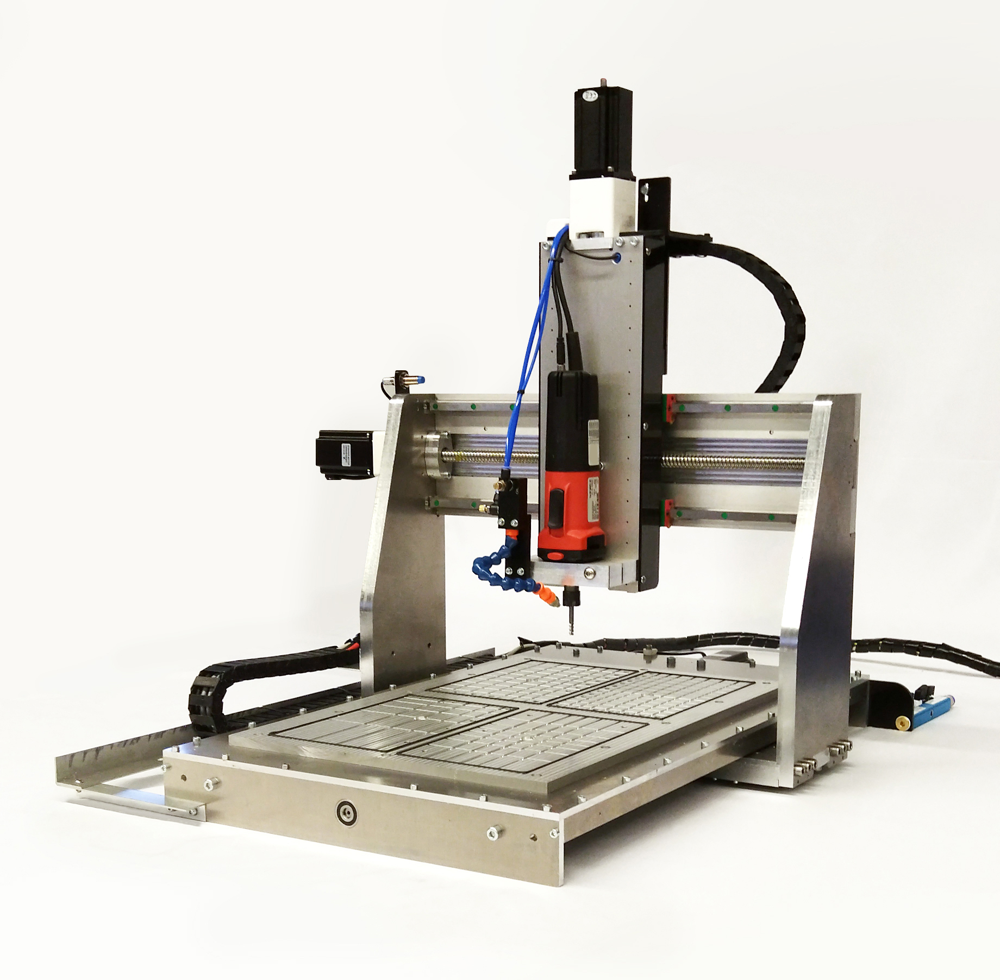

<h1 style=align="center">OLSK Small CNC</h1>

<i>Open Source CNC Milling machine - Small version - Open Lab Starter Kit</i>

 

Specifications
--

- cutting area: 600x400x170mm
- frame: solid aluminum
- motion: ball screws 12 and 16mm
- guides: 15mm linear rails
- motors: stepper motor NEMA 24
- additional: modular vacuum bed

Author
--

 

OLSK Small CNC has been designed and built by **[InMachines Ingrassia GmbH](https://www.inmachines.net/)**.

Machine design:
- **[Daniele Ingrassia](https://www.linkedin.com/in/danieleingrassia/)**

The machine is part of the **[Open Lab Starter Kit (OLSK)](https://www.inmachines.net/open-lab-starter-kit)** group of open source digital fabrication machines.

OLSK is developed by **[InMachines Ingrassia GmbH](https://www.inmachines.net/)** for the **[Dtec project](https://dtecbw.de/home/forschung/hsu/projekt-fabcity)** at **[Fab City Hamburg](https://www.fabcity.hamburg/en/)**.

OLSK Partners:
  

Contact
--

- daniele@inmachines.net
- [https://www.inmachines.net/](https://www.inmachines.net/)

License
--

Hardware design, CAD and PCB files, BOM, settings and other technical or design files are released under the following license:

- CERN Open Hardware Licence Version 2 Weakly Reciprocal - **[CERN-OHL-W](LICENSE_CERN_OHL_W_V2.txt)**

Assembly manual, pictures, videos, presentations, description text and other type of media are released under the following license:

- Creative-Commons-Attribution-ShareAlike 4.0 International - **[CC BY-SA 4.0](LICENSE_CC_BY_SA_4.0.txt)**
